# evaplot

An up-to-date and slimmed down library for opinionated plotting styles with seaborn and matplotlib.

## Installation

```bash
pip install evaplot
```

## Quick Start

```python
import evaplot
import seaborn as sns
import matplotlib.pyplot as plt

# Apply a style (downloads fonts on first use)
evaplot.set_style("evaplot_rc")

# Use seaborn/matplotlib as usual
fig, ax = plt.subplots()
sns.barplot(data=my_data, x="category", y="value", ax=ax)
plt.show()
```

## Styles

evaplot ships six styles, each using a different Google Font (downloaded automatically on first import):

| Style | Font |
|---|---|
| `evaplot_rc` | Roboto Condensed |
| `evaplot_fsc` | Fira Sans Condensed |
| `evaplot_j` | Jost |
| `evaplot_m` | Montserrat |
| `evaplot_sg` | Space Grotesk |
| `evaplot_tw` | Titillium Web |


### Gallery


#### `evaplot_rc` — Roboto Condensed

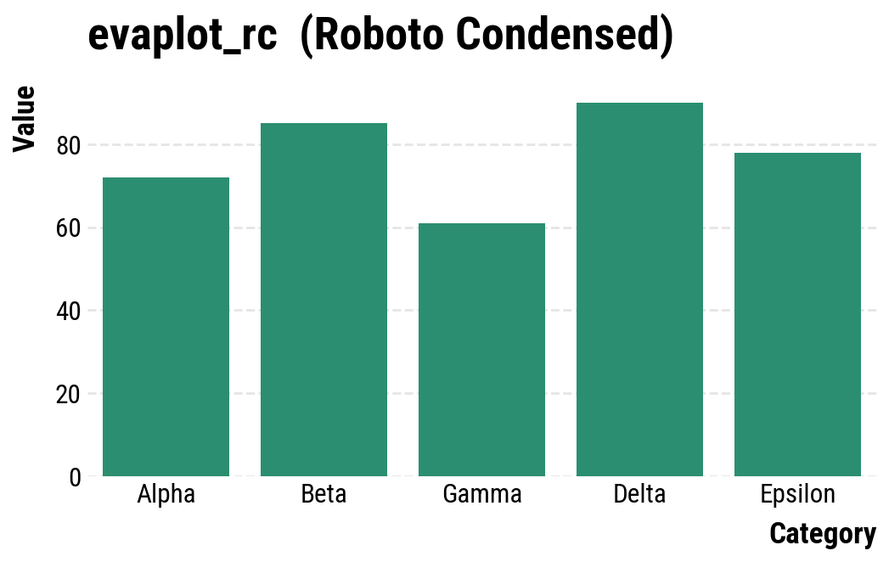


#### `evaplot_fsc` — Fira Sans Condensed

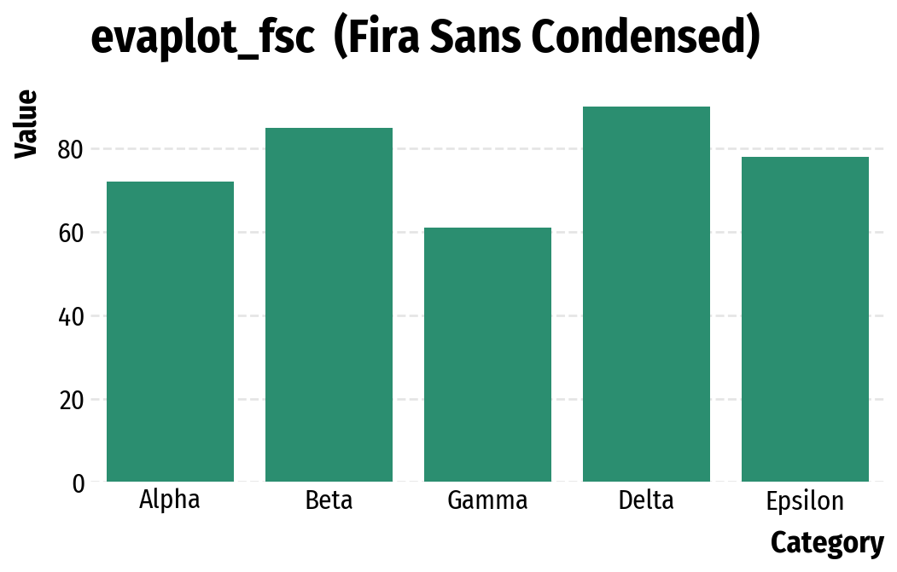


#### `evaplot_j` — Jost

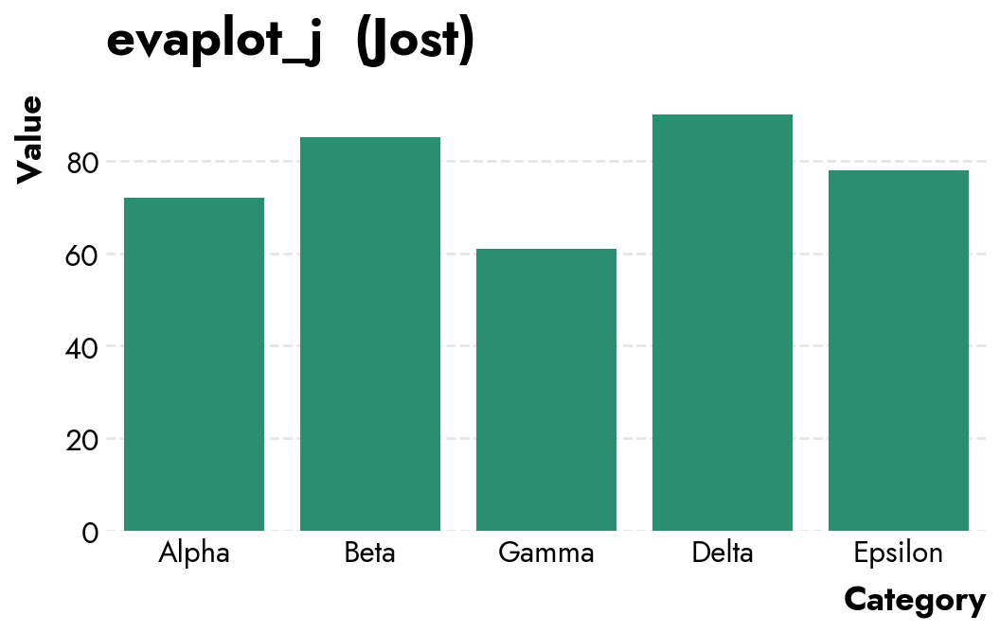


#### `evaplot_m` — Montserrat

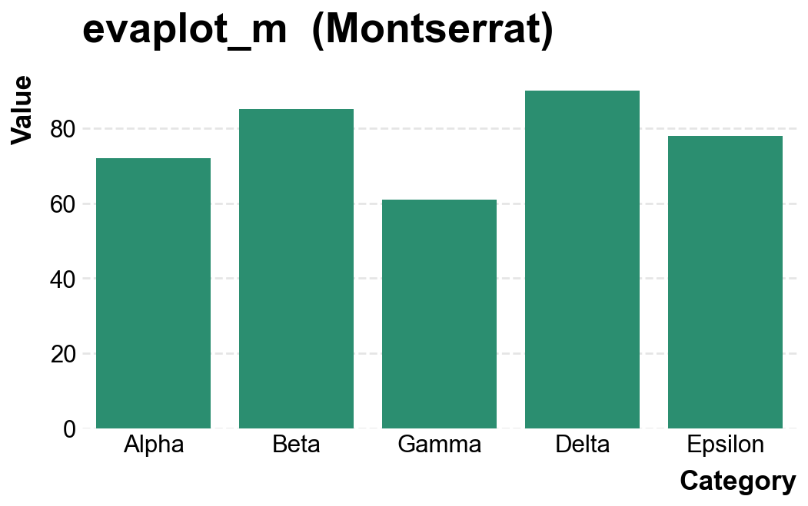


#### `evaplot_sg` — Space Grotesk

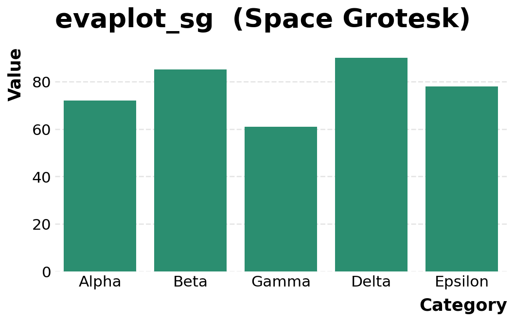


#### `evaplot_tw` — Titillium Web

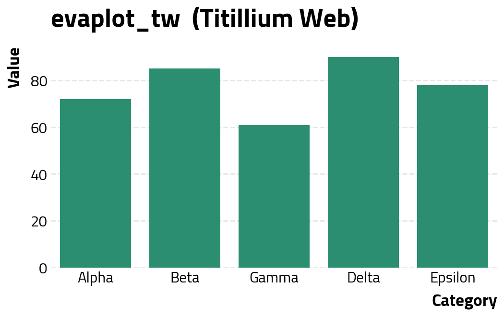


## Helper Functions

### `rotate_xticklabels`

Rotates x-axis tick labels to prevent overlap on busy categorical axes.

```python
evaplot.rotate_xticklabels(ax, rotation=45)
```

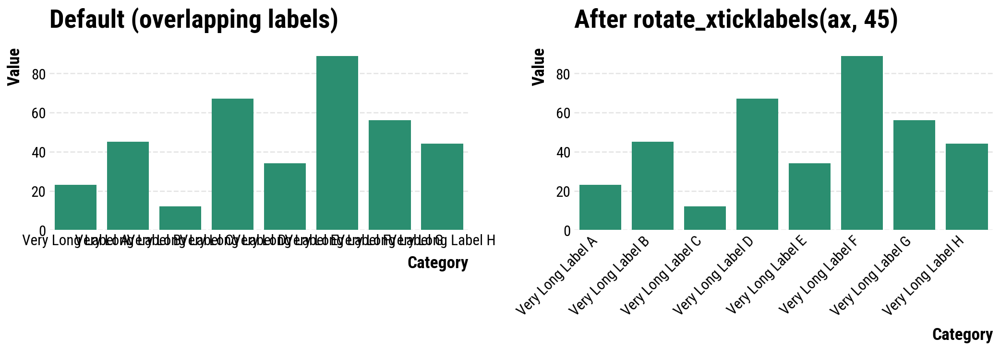

---

### `move_legend`

Moves a seaborn legend with sensible bottom-centered defaults.

```python
evaplot.move_legend(ax_or_facetgrid, bbox_to_anchor=(0.5, -0.15), loc="upper center", ncol=3)
```

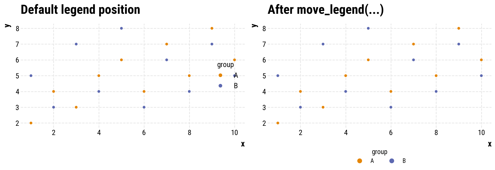

---

### `adjust_layout`

Adjusts subplot spacing and applies `tight_layout` in one call. Pass `g.fig` for a seaborn FacetGrid, or omit `fig` to operate on the current figure.

```python
evaplot.adjust_layout(fig=fig, hspace=0.35, wspace=0.3)
```

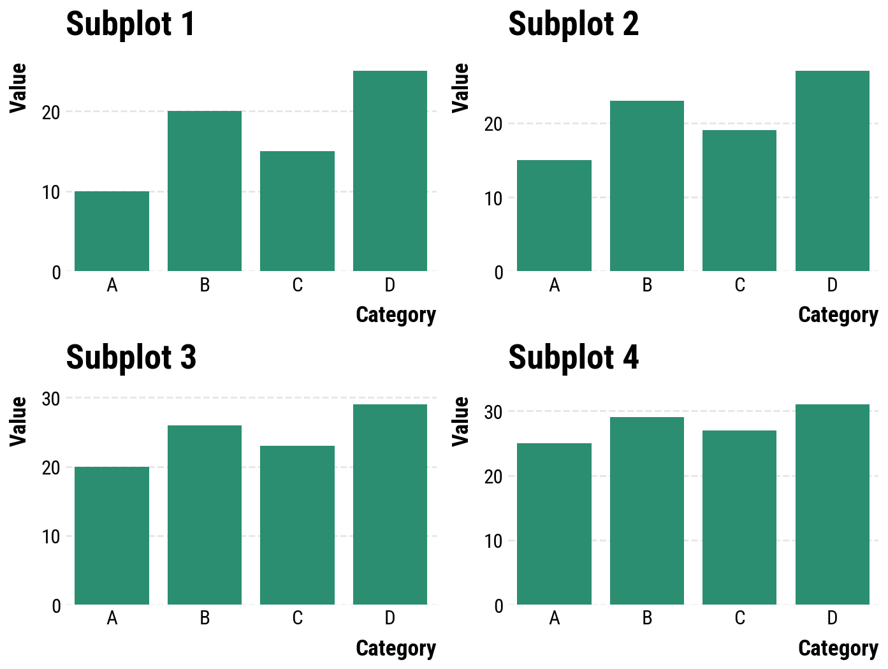

---

### `set_facet_col_titles`

Simplifies FacetGrid column titles using a template string. By default strips the verbose `"col = value"` prefix.

```python
evaplot.set_facet_col_titles(g, "{col_name}")
```

<table>
<tr>
<td align="center"><b>Before</b></td>
<td align="center"><b>After</b></td>
</tr>
<tr>
<td>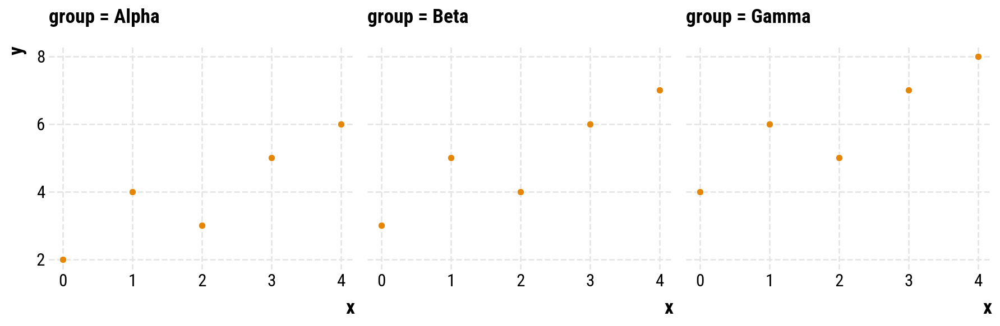</td>
<td>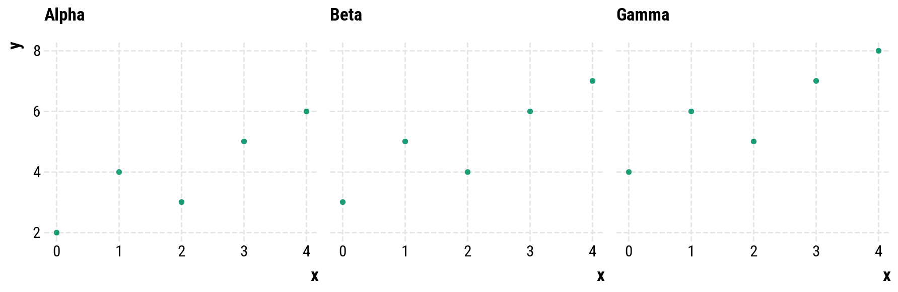</td>
</tr>
</table>

---

## API Reference

| Function | Description |
|---|---|
| `set_style(style, n)` | Apply an evaplot style and categorical palette |
| `set_cat_palette(n)` | Set categorical palette (`dark2` for n ≤ 8, `vivid` otherwise); returns hex color list |
| `rotate_xticklabels(ax, rotation, ha)` | Rotate x-axis tick labels |
| `move_legend(obj, bbox_to_anchor, loc, ncol, ...)` | Move a seaborn legend with opinionated defaults |
| `adjust_layout(fig, hspace, wspace, bottom, rect)` | Adjust subplot spacing and apply `tight_layout` |
| `set_facet_col_titles(g, template)` | Set FacetGrid column title template |
| `show_installed_fonts()` | List font families in evaplot's font cache |
| `update_matplotlib_fonts()` | Register all cached fonts with matplotlib |
| `download_googlefont(font, add_to_cache)` | Download a Google Font to the cache |

## Credits

evaplot builds on [opinionated](https://github.com/MNoichl/opinionated) by Maximilian Noichl.

> Noichl, M. (2023). Opinionated: Simple, Clean Stylesheets for Plotting with Matplotlib and Seaborn (Version 0.0.2.8) [Computer software]. https://doi.org/10.5281/zenodo.8329780

## License

MPLv2 License
